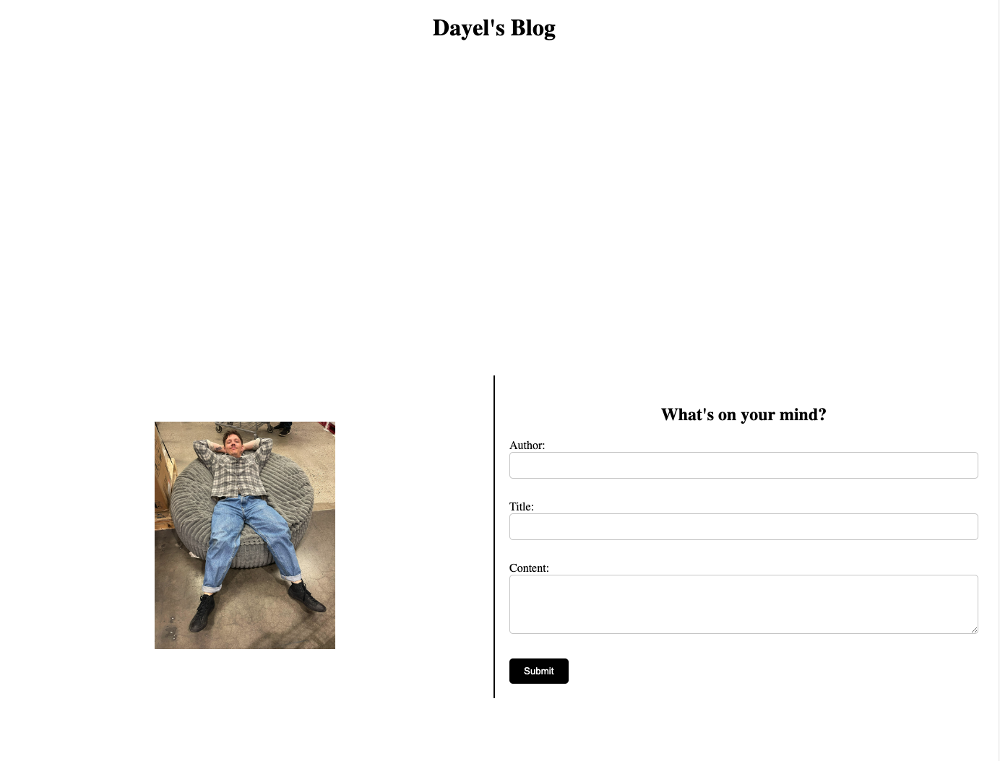
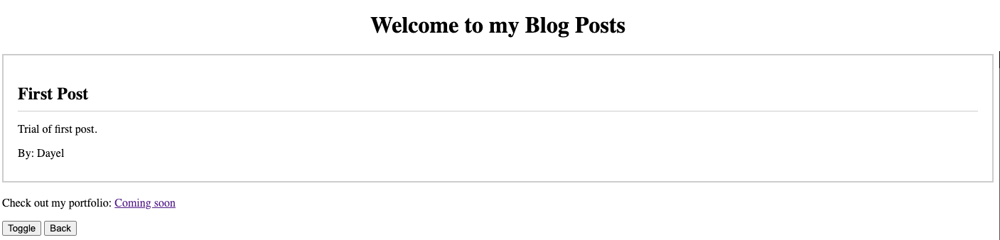

# Dayel-s-blog

Description:

My blog is a simple web application that allows users to create and view their blog posts. Users can input their username, post title, and content to create a new blog post, which is displayed on the blog page along with existing posts.

Features:
* Create a new blog post with username, title, and content.
* Open project storage in the code editor.
* Open the 'index.html' file in web browser

Usage:
* Open 'index.html' file in web browser.
* Enter username, title, and content into input fields.
* Click "submit" button to create new post
* Existing blog posts will be displayed below form.
* Click "Toggle Mode" button to switch between light and dark mode.

Technologies used:
* HTML
* CSS
* JavaScript

Screenshots

License:

This project is licensed under the MIT license.

Link to application:
https://ddprzy37.github.io/Dayel-s-blog/
Author:
Dayel Przybyla